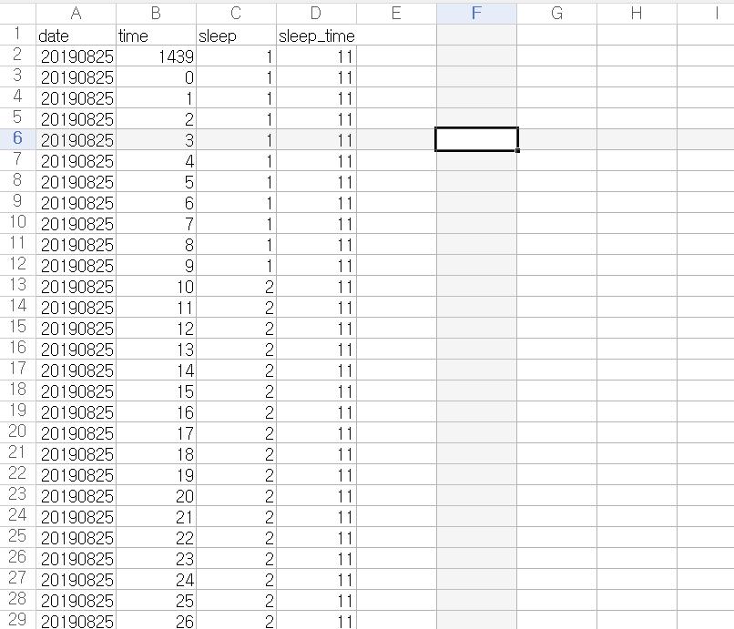
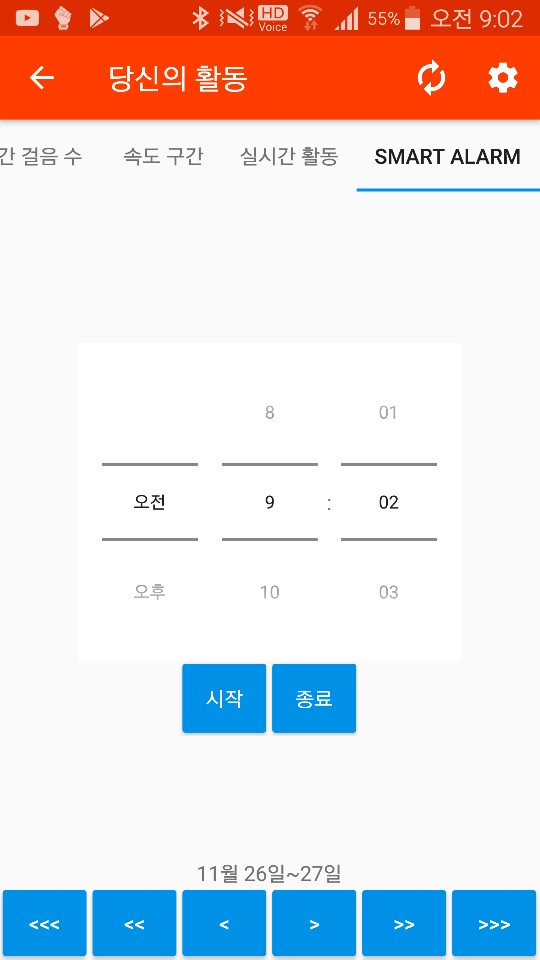
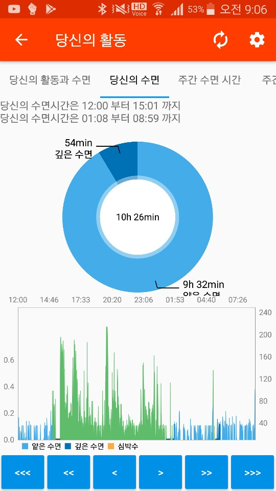

# YourSleeping
- 제주대학교 컴퓨터 공학과 SW 프로젝트 제출
- 사람의 수면은 렘수면(REM Sleep)과 비렘수면(Non-REM Sleep)으로 나뉩니다.
- 이 두 수면의 차이점은 수면의 깊이 입니다. 렘수면의 경우 얕은 수면, 비렘수면의 경우 깊은 수면을 나타냅니다.
- 이때 사람이 수면에 들고 깨어날 때 렘수면의 경우 기상상태와 뇌파가 비슷해 비렘수면보다 보다더 상쾌한 느낌을 받을 수 있습니다.
- 때문에 렘수면을 예측할 수 있는 인공지능을 활용한 알람 조정 프로젝트 입니다.

#### 데이터

    

- 저희 데이터는 보다시피 날짜, 시간, 수면상태, 잠든 시간으로 구분되어 있습니다.
- 이중 인공지능에 사용한 컬럼은 시간과 잠든 시간으로 이를 이용해 정확도를 70%후반까지 끌어올렸습니다.

#### 화면

- 이 화면에서 알람을 설정하면 기존에 있던 수면패턴을 이용해 가장 가까이 있는 렘수면을 찾아 해당 시간으로 알람시간을 조정합니다.

- 해당 화면에서는 잠든 수면 패턴을 시각화 시켜 한눈에 볼 수 있게 표시되었습니다.

